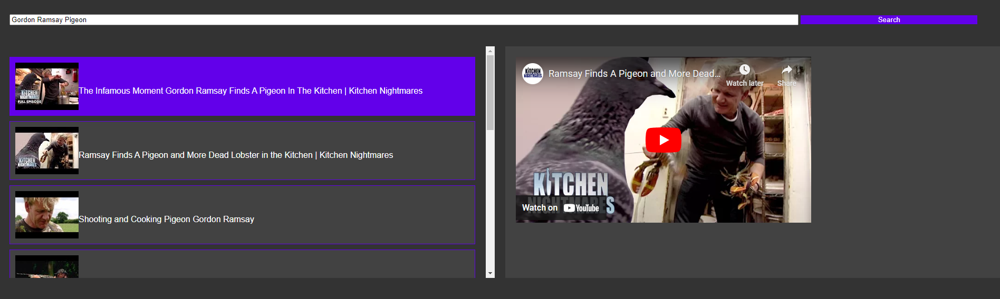

# youtube-no-ads
Purely for educational purposes. A method to watch YouTube videos and bypass the adverts. Requires a Google API Key. 

## Set Up
1. Download the .html file
2. Follow the [steps](https://scribehow.com/embed/How_to_Enable_YouTube_Data_API_v3_and_Generate_API_Key__so6BO10dQmC4lZPPR-vwuw?skipIntro=true) to acquire a Youtube API key. 
3. Copy the API key and paste into the .html where it states "\<USER-API-KEY-HERE>" (the crocodile <> brackets are not required) 
4. Open the .html file in a browser (tested in Chrome) and you can search & play youtube videos without adverts.

## Troubleshooting
1. You've got the wrong API key, verify you collected the Youtube Data V3 Public Data API key (as per the steps above).
2. You've inserted the API key incorrectly into the .html and broke the formatting.
3. The API key isn't valid
4. Youtube have updated their systems so this method no longer works

5. 
