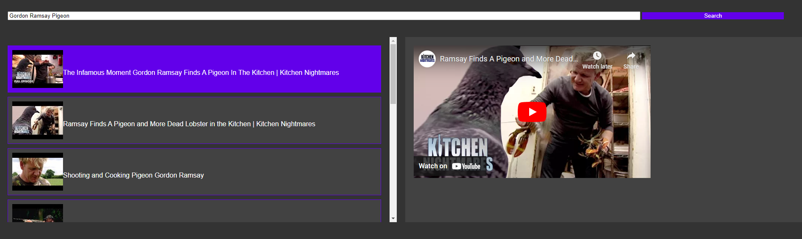

# Ad-Free Youtube Viewer
Developed solely for educational purposes, this solution enables ad-free YouTube video playback by leveraging the YouTube Data API with a user-provided Google API Key. Acknowledging the generous provision of free API keys by companies like Google for developmental purposes, it's crucial to exercise responsible usage.

## Operational Overview
The process involves querying the YouTube API using a user-generated API key linked to their account. The application fetches video URLs and plays them seamlessly in an embedded IFrame, offering an uncomplicated way to enjoy YouTube content without ads.

## Constraints
Be mindful of the free-tier API key's limitations, with a daily request cap. Exceeding this limit temporarily disables the web page until the reset period.

## Set Up
1. Download the .html file
2. Follow the [steps](https://scribehow.com/embed/How_to_Enable_YouTube_Data_API_v3_and_Generate_API_Key__so6BO10dQmC4lZPPR-vwuw?skipIntro=true) to acquire a Youtube API key. 
3. Copy the API key and paste into the .html where it states &lt;USER-API-KEY-HERE&gt; (the crocodile <> brackets are not required) 
4. Open the .html file in a browser (tested in Chrome) and you can search & play youtube videos without adverts.

## Troubleshooting
1. You've got the wrong API key, verify you collected the Youtube Data V3 Public Data API key (as per the steps above).
2. You've inserted the API key incorrectly into the .html and broke the formatting.
3. The API key isn't valid
4. Youtube have updated their systems so this method no longer works

**Note: This project is intended for educational purposes only. Ensure compliance with ethical guidelines and responsible use of API keys in your development activities.**
